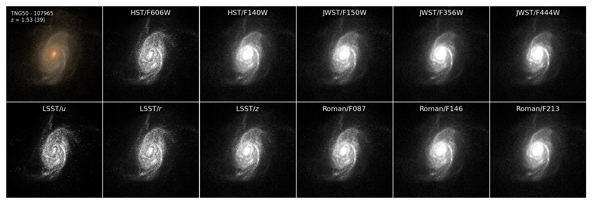

# GalSyn

<div align="center">
  
</div>

<div align="center">
  
</div>


**GalSyn** is a modular Python package designed for generating realistic synthetic spectrophotometric 
observations of galaxies from hydrodynamical simulation data. By employing particle-by-particle spectral modeling to 
3D data from hydrodynamical simulation such as IllustrisTNG and EAGLE, GalSyn enables the generation of realistic 
synthetic spectrophotometric data cubes, including broadband imaging and Integral Field Unit (IFU) spectroscopy. 
Beyond light synthesis, the tool produces comprehensive 2D physical property maps of the stellar populations, gas, 
and dust, as well as the decoupled kinematics of both stellar and gaseous components. 

A core philosophy of GalSyn is providing extensive flexibility over the physical ingredients involved in the 
synthesis procedure. This includes highly flexible control over the stellar population synthesis (SPS) modeling, 
and customize underlying components such as Initial Mass Functions (IMFs), stellar isochrones (e.g., MIST, Padova, BaSTI), 
stellar spectral libraries (e.g., MILES, BaSeL), and binary stellar evolution (BPASS). Furthermore, GalSyn implements 
highly flexible analytical dust attenuation models, allowing users to choose between fixed empirical laws or dynamic 
prescriptions with variable UV bump strengths and power-law slopes.

While traditional radiative transfer codes offer high physical rigor, they are often computationally intensive and 
offer limited flexibility regarding stellar population choices. GalSyn is built for computational efficiency and 
highly flexible user control, allowing for large-scale population studies and systematic exploration of how different 
physical assumptions (like IMF or dust laws) impact emergent galaxy light.

For more detailed information about the physical ingredients and algorithms, please see [Abdurro'uf et al. (2026)](https://ui.adsabs.harvard.edu/abs/2026arXiv260323986A/abstract).


## Installation

### Installing stable version

GalSyn is available as a package on PyPI and can be installed by executing the following command:

```
pip install galsyn
```

### Installing development version

If you want to install the most recent version of GalSyn, you can clone it from its GitHub repository and install:

```
git clone https://github.com/aabdurrouf/GalSyn.git
cd GalSyn
python -m pip install .
```

## Citation
If you use this code for your research, please reference [Abdurro'uf et al. (2026)](https://ui.adsabs.harvard.edu/abs/2026arXiv260323986A/abstract):

```
@ARTICLE{2026arXiv260323986A,
       author = {{Abdurro'uf} and {Ferguson}, Henry C. and {Salim}, Samir and {Iyer}, Kartheik G. and {Bradley}, Larry D. and {Coe}, Dan and {Saputra Haryana}, Novan and {Hassan}, Sultan and {Jung}, Intae and {Khullar}, Gourav and {Morishita}, Takahiro and {Mowla}, Lamiya},
        title = "{GalSyn I: A Forward-Modeling Framework for Synthetic Galaxy Observations from Hydrodynamical Simulations and First Data Release from IllustrisTNG}",
      journal = {arXiv e-prints},
     keywords = {Astrophysics of Galaxies},
         year = 2026,
        month = mar,
          eid = {arXiv:2603.23986},
        pages = {arXiv:2603.23986},
archivePrefix = {arXiv},
       eprint = {2603.23986},
 primaryClass = {astro-ph.GA},
       adsurl = {https://ui.adsabs.harvard.edu/abs/2026arXiv260323986A},
      adsnote = {Provided by the SAO/NASA Astrophysics Data System}
}
``` 

## Updates 

### 2026-10-08 (v0.1.7)
- **Line-of-sight (LOS) convention.** The LOS depth and LOS velocity are now measured along the axis pointing *away* from the observer (w = −z′ in the projection frame of Fig. 2). The projection frame itself, the viewing angles (polar, azimuth), and the image orientation are unchanged. The particle closest to the observer has LOS distance 0, with distances increasing away from the observer, as described in the paper, and the dust-attenuation step uses this definition to identify the gas in front of each star. LOS velocities are positive for receding material, consistent with `doppler_shift_spectrum`. Outputs generated with earlier versions may differ in resolved dust-attenuation maps and in the sign of the LOS-velocity maps. In our tests the impact on integrated attenuation was small.
- **New dust-attenuation maps** (FSPS and Bagpipes backends):
  - `EFF_A_REST_V`: effective rest-frame V-band attenuation, A = −2.5 log10(ΣL_dust / ΣL_no-dust), summed over all stars in a pixel (unattenuated stars count as A = 0), using the total spectrum (stellar continuum + nebular emission).
  - `EFF_A_REST_V_CONT`: the same quantity for the stellar continuum only.
  - `DUST_MEAN_AV_ALLSTARS`: mean diffuse-dust A_V over all star particles in a pixel (unattenuated stars count as 0).
  - Luminosities are summed before the ratio is taken when maps are rebinned.
- **V-band filter.** The effective-attenuation maps use the Johnson–Cousins V transmission curve (`galsyn/data/johnson_cousins_V.txt`) with photon-counting weighting.
- **Removed maps.** `DUST_MEAN_AV` and `DUST_MEAN_TAUV` are no longer written; `EFF_A_REST_V` and `DUST_MEAN_AV_ALLSTARS` replace them. The `analyze_props` tutorial and Example 8 were updated accordingly.
- **Bagpipes backend.** Fixed an `UnboundLocalError` that occurred when a pixel in the working grid contained no star particles.
