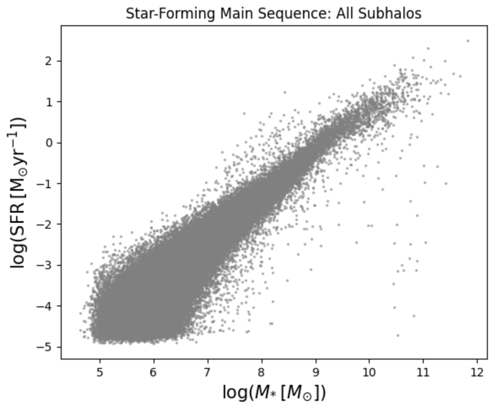
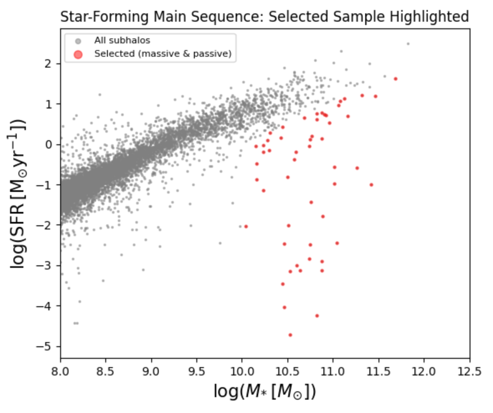
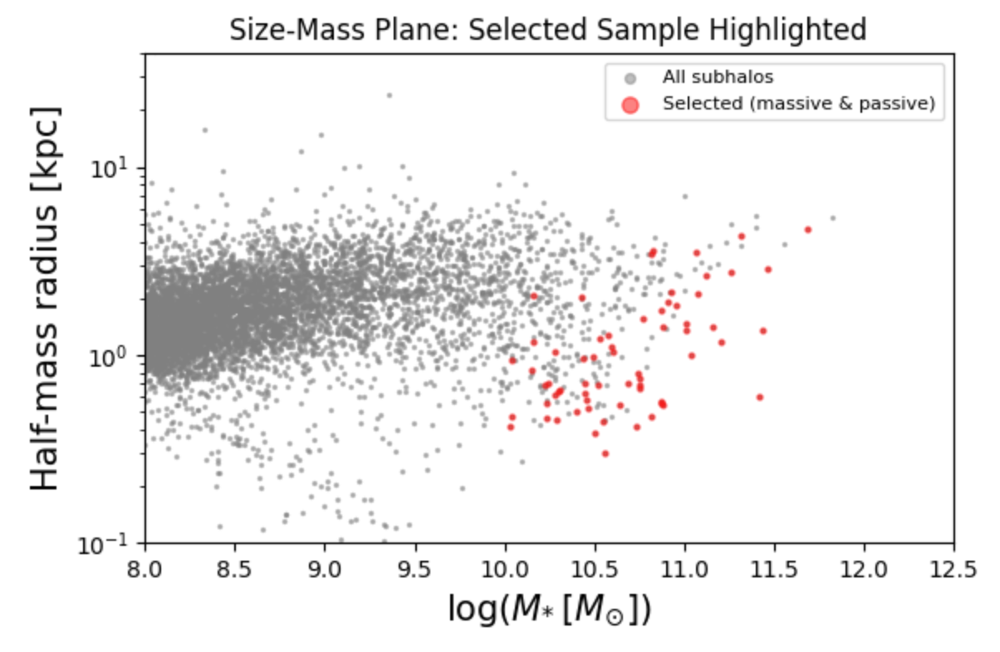
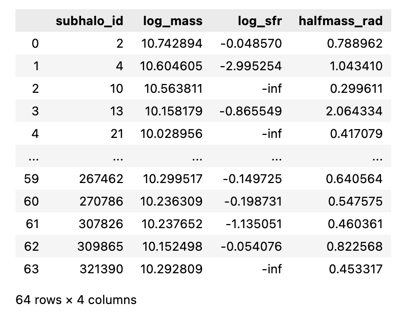

Further Tutorial: Selecting a Galaxy Sample from IllustrisTNG  
=============================================================

This tutorial demonstrates how to load group catalog of a specific snapshot from the TNG50-1 simulation using the `illustris_python <https://github.com/illustristng/illustris_python>`_ API, calculate physical properties, 
and filter galaxies based on mass and SFR. For this example, we will select a sample of massive, quiescent galaxies at z~1.5 (snapshot number=40). 

.. code-block:: python 

    import os, sys
    import numpy as np 
    import matplotlib.pyplot as plt 
    import illustris_python as il

We define the path to the simulation data and load the subhalo (galaxy) catalog for a specific snapshot (redshift). We point `illustris_python <https://github.com/illustristng/illustris_python>`_ at the simulation output directory and load
**all** subhalo fields for the chosen snapshot.

**Tip:** Change `snap_number` to select a different redshift. 
Use the `TNG snapshot table <https://www.tng-project.org/data/docs/specifications/#sec1a>`_ to find the snapshot index that corresponds to your target redshift. 
Download group catalogs from `this link <https://www.tng-project.org/data/downloads/TNG50-1/>`_ and follow instruction `at this link <https://www.tng-project.org/data/docs/scripts/>`_ for instructions on storing the data. 

.. code-block:: python 

    # Path to the TNG50-1 simulation output on the local disk
    basePath = '/Volumes/disk4tb/data/TNG/TNG50-1/output'

    # Snapshot number 40 corresponds to a specific redshift (e.g., z ≈ 1.5)
    snap_number = 40

    # Load the subhalo (galaxy) catalog from the groupcat
    subhalos = il.groupcat.loadSubhalos(basePath, snap_number)

In this example, we pull three key fields from the catalog and convert them to physical units. 
The Hubble parameter **h = 0.6774** converts the raw simulation mass unit (10^10 M_sun / h) to solar masses. 
More fields from the catalog can be seen at `this link <https://www.tng-project.org/data/docs/specifications/#sec2b>`_.

.. code-block:: python 

    # Hubble parameter for TNG simulations
    h = 0.6774

    # Extract stellar mass within twice the stellar half-mass radius (index 4 = stars)
    # Convert from 1e10 M_sun/h to M_sun
    mstar_2re = subhalos['SubhaloMassInRadType'][:,4] * 1e+10 / h 

    # Extract the Star Formation Rate (SFR) and the half-mass radius
    sfr_2re = subhalos['SubhaloSFRinRad']

    # get half stellar mass radius and convert into kpc
    from galsyn.simutils_tng import get_snap_z
    api_key = "7ae4d3ea8a7c808a0932e62abc69dde4"
    snap_z = get_snap_z(snap_number, sim='TNG50-1', api_key=api_key)
    snap_a = 1.0/(1.0 + snap_z)
    halfmass_rad = subhalos['SubhaloHalfmassRadType'][:,4] * snap_a / h  # in kpc

    # Print the total number of subhalos found in this snapshot
    snap_ngals = len(mstar_2re)

We plot **log(SFR)** vs. **log(M_star)** for every subhalo in the snapshot. This diagnostic plot reveals the full galaxy population, 
including the star-forming main sequence and the cloud of passive/quenched objects below it.

.. code-block:: python 

    fig, ax = plt.subplots(figsize=(6, 5))

    # All subhalos plotted in grey with low opacity
    ax.scatter(np.log10(mstar_2re), np.log10(sfr_2re),
            s=2, color='gray', alpha=0.5)

    ax.set_xlabel(r'$\log(M_{*}\,[M_{\odot}])$', fontsize=15)
    ax.set_ylabel(r'$\log(\rm{SFR}\,[M_{\odot}\rm{yr}^{-1}])$', fontsize=15)
    ax.set_title('Star-Forming Main Sequence: All Subhalos')

    plt.tight_layout()
    plt.show()

In this example, we select subhalos that are massive and passive (quiescent). The selected galaxies are then overplotted in **red** on the star-forming main sequence diagram.

.. code-block:: python 

    # Selection mask: massive (log M* > 10) AND passive (sSFR < 10^-10 / yr)
    idx_select = np.where(
        (np.log10(mstar_2re) > 10.0) &                               # mass cut
        (np.log10(sfr_2re) - np.log10(mstar_2re) < -10.0)           # sSFR cut
    )[0]

    print('Number of selected galaxies: %d' % len(idx_select))

    # --- Diagnostic plot ---
    fig, ax = plt.subplots(figsize=(6, 5))

    ax.set_xlim(8.0, 12.5)

    # Background: all subhalos (grey)
    ax.scatter(np.log10(mstar_2re), np.log10(sfr_2re),
            s=2, color='gray', alpha=0.5, label='All subhalos')

    # Foreground: selected passive massive galaxies (red)
    ax.scatter(np.log10(mstar_2re[idx_select]), np.log10(sfr_2re[idx_select]),
            s=5, color='red', alpha=0.5, label='Selected (massive & passive)')

    ax.set_xlabel(r'$\log(M_{*}\,[M_{\odot}])$', fontsize=15)
    ax.set_ylabel(r'$\log(\rm{SFR}\,[M_{\odot}\rm{yr}^{-1}])$', fontsize=15)
    ax.set_title('Star-Forming Main Sequence: Selected Sample Highlighted')
    ax.legend(markerscale=3, fontsize=8)

    plt.tight_layout()
    plt.show()

We plot the stellar **half-mass radius** against **log(M_star)** for all subhalos and highlight the selected passive sample in red.

.. code-block:: python 

    fig, ax = plt.subplots(figsize=(6, 4))

    ax.set_xlim(8.0, 12.5)
    ax.set_ylim(0.1, 40.0)
    ax.set_yscale('log')   # log y-axis to capture the full size dynamic range

    # Background: all subhalos (grey)
    ax.scatter(np.log10(mstar_2re), halfmass_rad,
            s=2, color='gray', alpha=0.5, label='All subhalos')

    # Foreground: selected massive passive galaxies (red)
    ax.scatter(np.log10(mstar_2re[idx_select]), halfmass_rad[idx_select],
            s=5, color='red', alpha=0.5, label='Selected (massive & passive)')

    ax.set_xlabel(r'$\log(M_{*}\,[M_{\odot}])$', fontsize=15)
    ax.set_ylabel('Half-mass radius [kpc]', fontsize=15)
    ax.set_title('Size-Mass Plane: Selected Sample Highlighted')
    ax.legend(markerscale=3, fontsize=8)

    plt.tight_layout()
    plt.show()

Show list of selected galaxies in a table.

.. code-block:: python 

    import pandas as pd

    # Accumulate one record per selected galaxy
    selected_galaxies = []
    for idx in idx_select:
        # Use a descriptive variable name to avoid shadowing the built-in 'dict'
        entry = {
            'subhalo_id':   int(idx),                      # integer catalog row index
            'log_mass':     np.log10(mstar_2re[idx]),      # log10 stellar mass  [M_sun]
            'log_sfr':      np.log10(sfr_2re[idx]),        # log10 SFR  [M_sun/yr]  (-inf if SFR=0)
            'halfmass_rad': halfmass_rad[idx],             # stellar half-mass radius
        }
        selected_galaxies.append(entry)

    # Convert the list of dicts to a Pandas DataFrame
    df = pd.DataFrame(selected_galaxies)
    df

