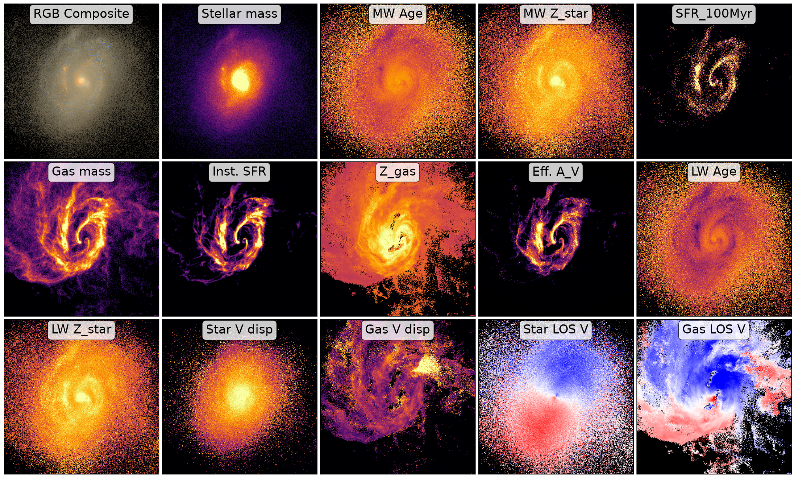

Analyzing Spatially Resolved Physical Property Maps
===================================================

After running the synthesis process, GalSyn produces a comprehensive FITS file containing synthetic imaging, IFU data cubes, and extensive set of physical property maps. 
The script below demonstrates how to visualize these spatially resolved phsyical property maps.

.. code-block:: python

    import numpy as np
    import matplotlib.pyplot as plt
    import matplotlib.cm as cm 
    from astropy.io import fits
    from astropy.visualization import simple_norm, make_lupton_rgb

    # Input synthetic data cube
    fits_filename = 'galsyn_62_132810_specphoto.fits'

    # Your specific HDU names and labels
    hdu_names = [
        'STARS_MASS', 'MW_AGE', 'STARS_MW_ZSOL', 'SFR_100MYR', 'GAS_MASS', 'SFR_INST', 
        'GAS_MW_ZSOL', 'EFF_A_REST_V', 'LW_AGE_DUST', 'LW_ZSOL_DUST', 
        'STARS_VEL_DISP_LOS', 'GAS_VEL_DISP_LOS', 'STARS_MW_VEL_LOS', 
        'GAS_MW_VEL_LOS'
    ]

    prop_labels = {
        'STARS_MASS':'Stellar mass', 'MW_AGE': 'MW Age', 'STARS_MW_ZSOL': 'MW Z_star', 
        'SFR_100MYR': 'SFR_100Myr', 'GAS_MASS': 'Gas mass', 'SFR_INST': 'Inst. SFR', 
        'GAS_MW_ZSOL': 'Z_gas', 'EFF_A_REST_V': 'Eff. A_V', 'LW_AGE_DUST': 'LW Age', 
        'LW_ZSOL_DUST': 'LW Z_star', 'STARS_VEL_DISP_LOS': 'Star V disp', 
        'GAS_VEL_DISP_LOS': 'Gas V disp', 'STARS_MW_VEL_LOS': 'Star LOS V', 
        'GAS_MW_VEL_LOS': 'Gas LOS V'
    }

    # RGB Filters from your example
    rgb_fils = ['jwst_nircam_f115w', 'jwst_nircam_f150w', 'jwst_nircam_f200w']
    rgb_factor = 3e+3

    # Open the data cube
    hdulist = fits.open(fits_filename)

    # Calculate grid (Total = 1 RGB + all hdu_names)
    num_plots = len(hdu_names) + 1
    ncols = 5
    nrows = (num_plots + ncols - 1) // ncols

    fig, axes = plt.subplots(nrows, ncols, figsize=(4 * ncols, 4 * nrows), constrained_layout=True)
    axes = axes.flatten()

    # Panel 1: RGB image
    ax_rgb = axes[0]
    # Use the DUST_[FILTER] naming convention from your RGB example
    r = hdulist[f'DUST_{rgb_fils[2].upper()}'].data * rgb_factor
    g = hdulist[f'DUST_{rgb_fils[1].upper()}'].data * rgb_factor
    b = hdulist[f'DUST_{rgb_fils[0].upper()}'].data * rgb_factor

    rgb_image = make_lupton_rgb(r, g, b, stretch=20, Q=15)
    ax_rgb.imshow(rgb_image, origin='lower')
    ax_rgb.text(0.5, 0.93, "RGB Composite", transform=ax_rgb.transAxes, 
                bbox=dict(boxstyle="round,pad=0.3", facecolor="white", alpha=0.8), 
                verticalalignment='center', horizontalalignment='center', fontsize=22)
    ax_rgb.set_xticks([])
    ax_rgb.set_yticks([])

    # Subsequent panels: physical property maps
    for i, ext_name in enumerate(hdu_names):
        ax = axes[i + 1] # Offset by 1 to skip the RGB panel
        
        data = hdulist[ext_name].data

        # Inside your loop, before calling ax.imshow:
        if 'VEL_LOS' in ext_name:
            # NOTE: STARS_MW_VEL_LOS is the mass-weighted mean line-of-sight (LOS) velocity of the
            # star particles in each pixel (positive = receding/redshifted, negative = approaching/
            # blueshifted). It is a raw LOS velocity in the simulation frame, so it includes the
            # galaxy's bulk (systemic) peculiar velocity projected along the viewing direction,
            # on top of its internal motions (e.g., rotation). The offset can be much larger than
            # the rotation signal, and its sign and size depend on the viewing angle.
            # GalSyn does not remove it, so the maps stay consistent with the Doppler-shifted spectra
            # in the data cube.
            # To see the rotation pattern, we subtract the systemic velocity here, estimated as the
            # mass-weighted mean LOS velocity over all valid pixels. Empty pixels (value = 0) are
            # excluded from this estimate and shown in black.

            mass = hdulist['STARS_MASS'].data
            valid = (data != 0) & np.isfinite(data)
 
            # systemic LOS velocity = mass-weighted mean over the galaxy
            v_sys = np.nansum(mass[valid] * data[valid]) / np.nansum(mass[valid])
            vmap = np.ma.masked_where(~valid, data - v_sys)
            vmap = np.ma.masked_where(vmap == 0.0, vmap)   # also mask pixels whose final velocity is exactly zero

            vmax = np.nanpercentile(np.abs(vmap.compressed()), 98)
            cmap = plt.get_cmap('bwr').copy()
            cmap.set_bad(color='black')   # masked pixels shown in black

            im = ax.imshow(vmap, origin='lower', cmap=cmap, vmin=-vmax, vmax=vmax)

        else:
            cmap = plt.get_cmap('inferno').copy()
            cmap.set_bad(color='black')
            norm = simple_norm(data, 'sqrt', percent=98.0)
            im = ax.imshow(data, norm=norm, origin='lower', cmap=cmap)

        # Labels
        title_label = prop_labels.get(ext_name, ext_name)
        ax.text(0.5, 0.93, title_label, transform=ax.transAxes, 
                bbox=dict(boxstyle="round,pad=0.3", facecolor="white", alpha=0.8), 
                verticalalignment='center', horizontalalignment='center', fontsize=22)
        
        ax.set_xticks([])
        ax.set_yticks([])

    hdulist.close()

    plt.show()

